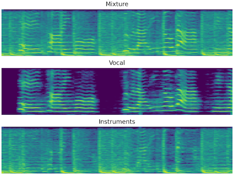

# torch-chimera
Unofficial pytorch implementation of deep clustering family

### Summary

This repo is an **unofficial** implementation of deep clustering [Hershey et al. ICASSP (2016)] and its succedents [Luo et al. ICASSP (2017)], [Wang et al. ICASSP (2018)], [Roux et al. ICASSP (2019)], [Roux et al. IEEE JSTSP (2019)].

The purpose of this repo is to perform single-source signal separation with deep neural networks.
Depicting with the following figure, the mixture of vocal and instruments music (top) is given to the model, and the model predicts mixtures sources (i.e. vocal (center) and instruments music (bottom)).



[Hershey et al. ICASSP (2016)]: https://arxiv.org/abs/1508.04306
[Luo et al. ICASSP (2017)]: https://arxiv.org/abs/1611.06265
[Wang et al. ICASSP (2018)]: https://ieeexplore.ieee.org/document/8462507
[Roux et al. ICASSP (2019)]: https://arxiv.org/abs/1810.01395
[Roux et al. IEEE JSTSP (2019)]: https://arxiv.org/abs/1810.01395

### Requirements

* `ffmpeg` : 4.2
* `numpy` : 1.18.4
* `pysocks` : 1.7.1
* `pysoundfile` : 0.10.2
* `python` : 3.7.6
* `pytorch` : 1.5.0
* `resampy` : 0.2.2
* `scikit-learn` : 0.21.3
* `scipy` : 1.4.1
* `torchaudio` : 0.5.0

See `requirements.txt` for more information.

### Prediction with pretrained models

#### Pretrained models

The pretrained models are based on the phasebook model [Roux et al. ICASSP (2019)].
The following table shows the list of pretrained models.

| Model name and link | Dataset | SNR    | SI-SDR | Note |
|---------------------|---------|--------|--------|------|
| [dsd100-wa020.pth]  | DSD100  | 3.1361 | -5.177 |      |
| [dsd100-dc025.pth]  | DSD100  | NA     | NA     |      |

**Note**: SNR and SI-SDR are average of all dataset and channels.

[dsd100-wa020.pth]: https://drive.google.com/file/d/1gCatPiG-JGE2dwRX7E8PkvbcPR-Y2cKF/view?usp=sharing
[dsd100-dc025.pth]: https://drive.google.com/file/d/1EaP4pH2hnNqY6ZfbStWD6B7qWyfspfnM/view?usp=sharing

#### Sample script

Source separation can be done with the following script using the model `models/model.pth`.

```shell
python scripts/chimera-torch.py predict \
  --input-model models/model.pth \
  --residual \
  --input-file mixture.wav \
  --output-files instrumental.wav vocal.wav 
```

### Training a model

TBA
